# Electronic Student Record

My main goal while creating this project was to learn spring, thymeleaf, html and MySQL as well as to consolidate my knowledge in Java.
Languages and frameworks used in the project:

- Java
- Spring boot, Spring Data, Spring MVC, Spring Security, Thymeleaf
- MySQL, Hibernate
- HTML, Bootstrap
- Maven

Things I would have done differently:
- The appearance of the page and dynamic change of the page content - e.g. filtering the table content.
- Security is failing in some places, unfortunately I was unable to deal with this problem.

TODO List:
- Absences
- Lesson plan
- Expansion of the administration and moderation panel
- Scale up the application so that it can run in multiple schools, not just one
- Unit tests

# Project Presentation:

## Sign in page :

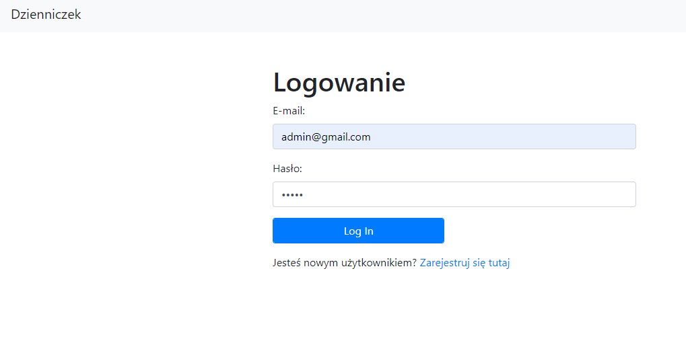

## Sign up page :

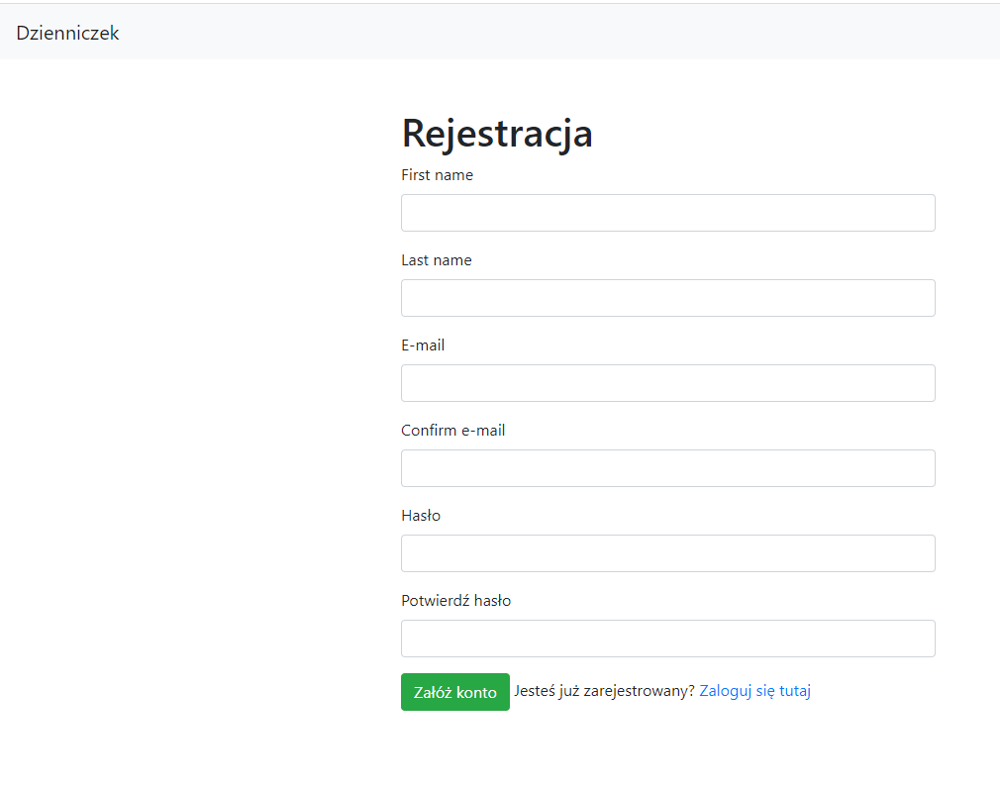

## Index: The content of this page varies depending on the permissions of the logged in user.
#### - The administrator has access to the moderator and administrator panel
#### - The moderator has access to the moderator's panel
#### - The teacher has access to the teacher's panel
#### - The student has access to the student panel

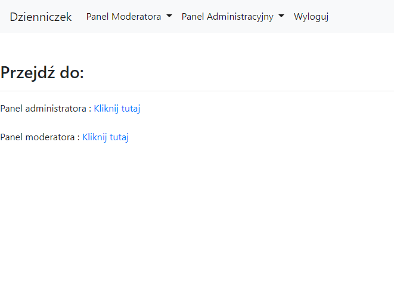

## Add class: Allows you to add a new class with the appropriate year and specialization. Each field has a corresponding validation

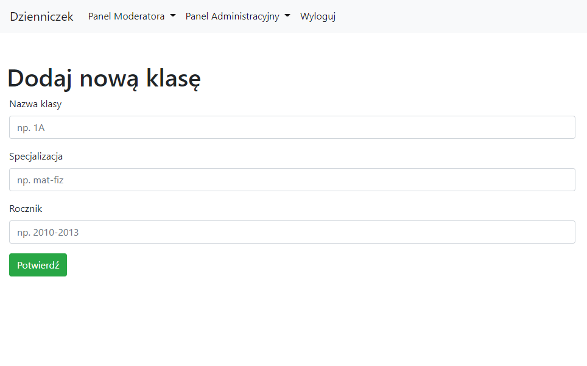

## Add subject: Adds a subject to a given class and also assigns a teacher (User with the role of teacher) to the subject

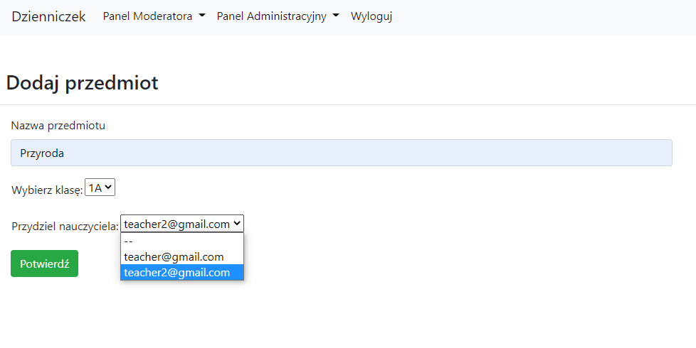

## User list: The main admin panel that allows you to edit user data, change their roles and also delete them. Also have a search button

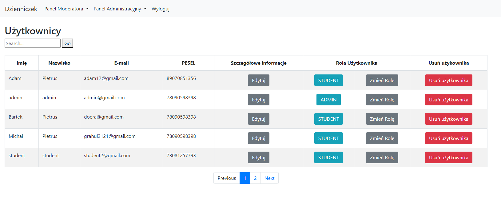

## User details: Allows you to set the user details of the content validation in the fields:
#### - PESEL
#### - Email
#### - Postal Code
#### - Phone number

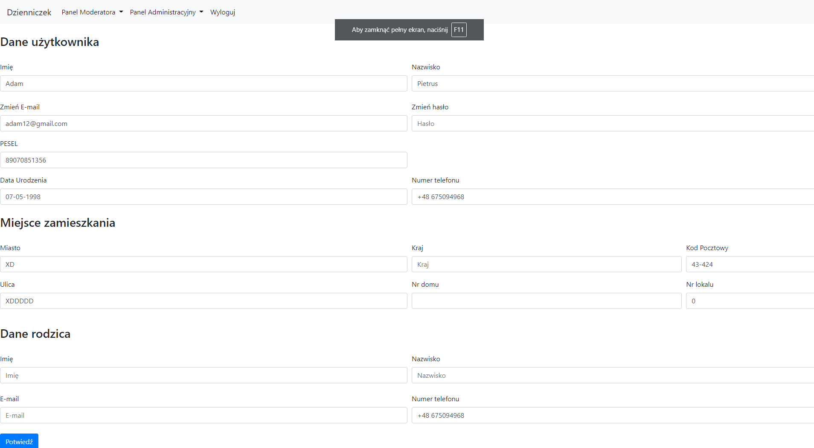

## Change user role : allows you to change user role

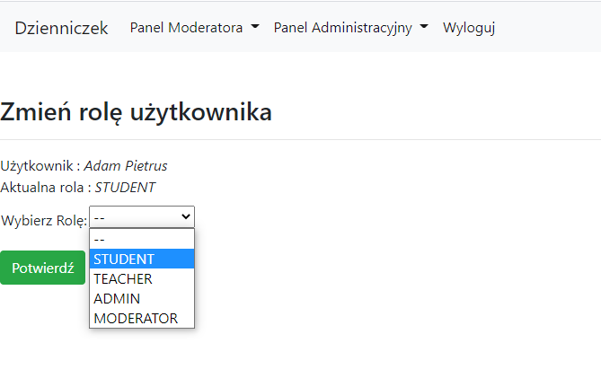

## List of Students in the moderator's panel with a search button.

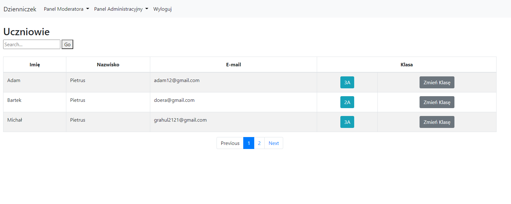

## Allows to change the class of the students, it is worth adding that when changing the class, the students numbers in the class are set and changed automatically

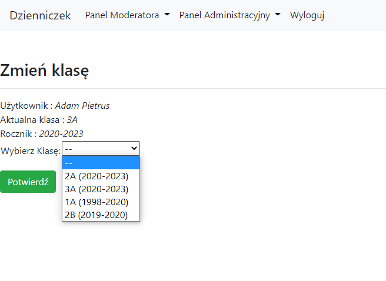

## Teacher have 2 panels one is user details which is similar to user details from admin panel and the other is add grades panel

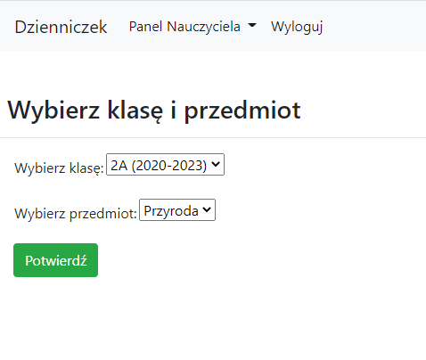

## After selecting your class and subject, you will see this panel :
## Here you can add partial grades, predicted final grades and final grades, you can also edit these grades, The average grade is displayed and calculated automatically

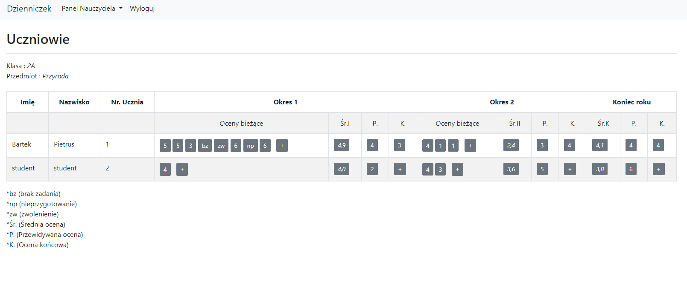

## Here you can add a new grade

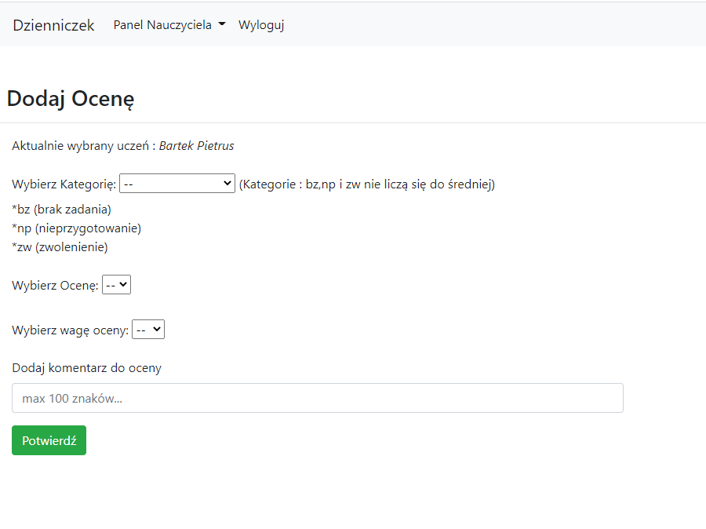

## And here you can edit it when you add or edit a rating, the date of its issuance is set automatically, previously selected rating settings are displayed automatically

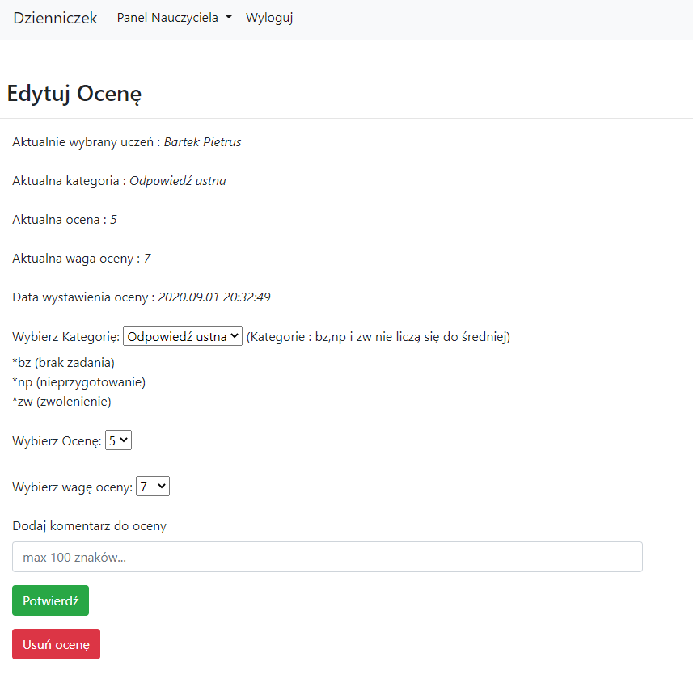

## Adding Final Predicted grade and Final grade looks the same

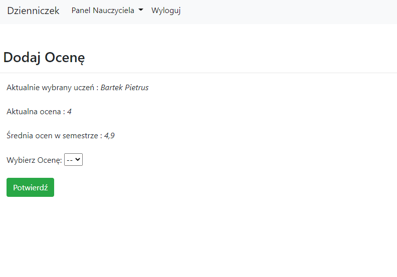

## User have only 2 panels one is user details which is similar to the admin user details and also show grades panel.
## The student can view his grades here

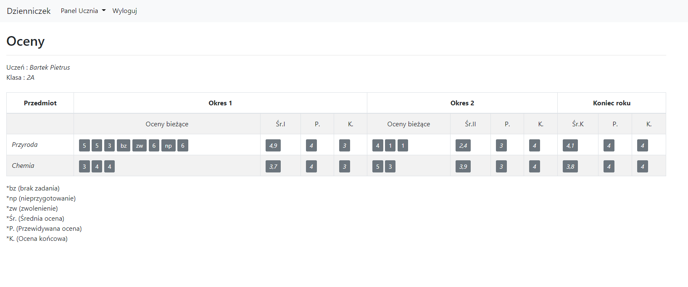

## When a student clicks on a grade, then he can see the grade details

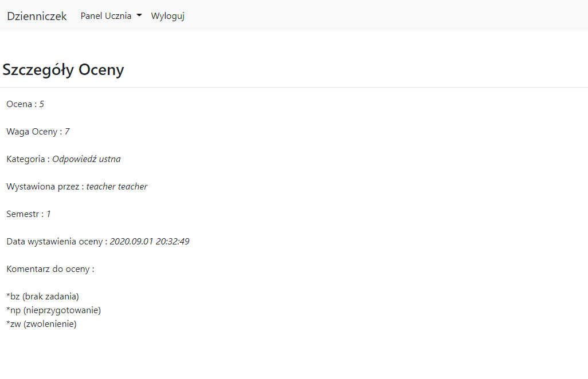